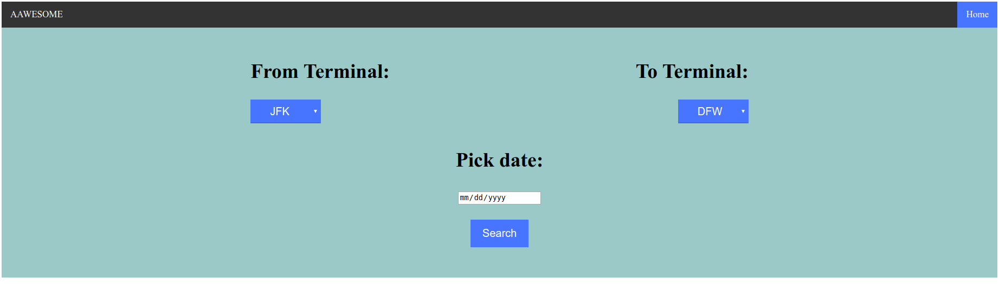
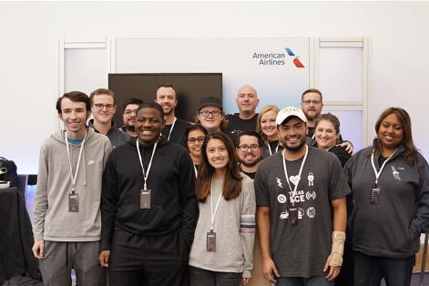

# HackTx 2019: Flight Delay Predictor (1st Place Winner)

## Overview

This repository contains a single-page website developed during the 2019 Austin Hackathon HackTx. The project aims to predict possible flight delays using data from American Airlines' flights and the Dark Sky API. Our team won 1st place in the American Airlines category during this 24-hour hackathon.

**Last Updated:** December 24, 2019

## Project Description

Our website utilizes a user-friendly interface created with HTML, CSS, and JavaScript. It leverages the American Airlines API and the Dark Sky API through HTTP GET requests to gather crucial information about weather conditions during a flight's time and location. Using this data, we implemented an algorithm that analyzes the information and predicts the likelihood of flight delays.

The primary goal of this project is to provide users with a tool to anticipate potential flight delays in advance, allowing for better travel planning and reduced inconvenience.

### Key Features

- Integration with American Airlines API
- Real-time weather data from Dark Sky API
- Custom delay prediction algorithm
- User-friendly interface for easy flight searches

## Prerequisites

To work with or deploy this project, you'll need:

- Knowledge of Google Cloud Services for website publishing
- Familiarity with Python Flask, HTML5, CSS, and JavaScript
- An API key for American Airlines and Dark Sky APIs
- Enthusiasm to learn and improve the project!

## How to Use

1. Enter the departure AA terminal
2. Input the arrival terminal
3. Select your flight date
4. Click "Search" to view the predicted weather conditions and potential delays

Website Interface

## Deployment

The website can be deployed using Google Cloud Services, using the free cloud services offered at the time of competition.

## Team Photo

Our team with the American Airlines sponsor at HackTx 2019:

Team Photo with American Airlines Sponsor

## Acknowledgments

We would like to thank American Airlines for sponsoring this category and providing access to their API. We also appreciate the organizers of HackTx 2019 for creating this opportunity for innovation and learning.

## Future Improvements

- Incorporate machine learning models for more accurate predictions
- Expand to include more airlines and airports
- Develop a mobile application for on-the-go access
- Implement real-time flight tracking features

